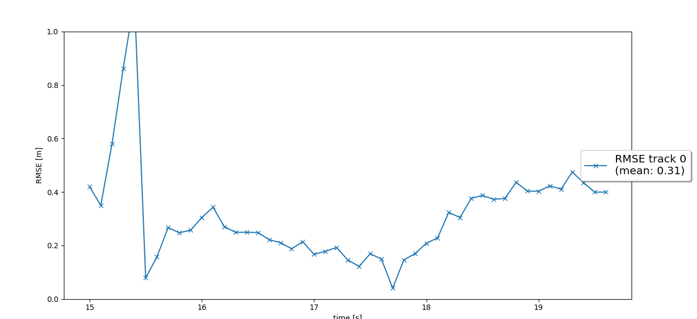

# Writeup: Track 3D-Objects Over Time

Please use this starter template to answer the following questions:

### 1. Write a short recap of the four tracking steps and what you implemented there (filter, track management, association, camera fusion). Which results did you achieve? Which part of the project was most difficult for you to complete, and why?


### 2. Do you see any benefits in camera-lidar fusion compared to lidar-only tracking (in theory and in your concrete results)? 


### 3. Which challenges will a sensor fusion system face in real-life scenarios? Did you see any of these challenges in the project?


### 4. Can you think of ways to improve your tracking results in the future?


# Self-Driving Car Beta Testing Nanodegree 

This is a template submission for the  second course in the  [Udacity Self-Driving Car Engineer Nanodegree Program](https://www.udacity.com/course/c-plus-plus-nanodegree--nd213) : Sensor Fusion and Tracking. 


## Sensor Fusion and Object detection

We have used the [Waymo Open Dataset's](https://console.cloud.google.com/storage/browser/waymo_open_dataset_v_1_2_0_individual_files) real-world data and applied an extended Kalman fusion filter for tracking several vehicles in this project. The following are the tasks completed:
- Building Kalman Filter system to track an object
- Object tracking and updating tracks (creating and deleting)
- Understanding the association between the data (sensor)
- Added camera sensor fusion based on lidar fusion 

The project can be run by running 

```
python loop_over_dataset.py
```
All training/inference is done on GTX 2060 in windows 10 machine.

## Step-1: Extended Kalman Filter

In the filter.py file, EKF is used.

- First design the system states [x, y, z, vx, vy, vz], the process model, and the constant velocity model.
- Next, compute the matrix of the 3D process model with constant covariance of velocity and noise (the system matrix). This is necessary for computing the state h(x) and the Jacobian H-function.
- h(x) and the Jacobi H function are evaluated to compute the current state.
- Kalman gains are computed and used to update the states and covariances.

This is shown in the followin image


The analysis of rmse with current time is shown in the below image (single tracking).




## Step-2: Track Management

Then track management is analyzed, track list can manage multiple objects. Objects are represented as tracks in the device architecture.
Forward route and measurement details to the Kalman filter to update each worker on the route.

The following steps were taken for this:

 Tracks are initially initialized with unassigned LIDAR calculations
- If a track's score correlates with a measurement, the corresponding score is increased and vice versa
- Tracks changing track conditions There is a ranking of
- If the score is below the specified 3 points and the health balance is above the threshold, the trace will not be removed for further consideration.

This is shown in the trackmanagement.py script:


The following image shows the rmse plot for single tracking .


## Step-3: Data Association

In this Step, nearest neighbor association correctly associates multiple measurements with multiple traces. Data associations are introduced in Association.py.
The following steps have been performed:

- Creating matrix with all tracks and overview open.
- Computes the distance from the Mahalanobis distance for each distance measure.
- Use the chi-square hypothesis test to exclude unlikely segment pairs. 
– Select the pair with the smallest Mahalanobis distance and update the Kalman filter to remove the corresponding row and column relation matrix.

The following image shows the MHD being applied for getting the closest track measurement:


The following graph is plotted.


## Step-4: Camera Sensor fusion

Now add a Kalman filter. The main assumption is the center of his 3D spatial bounding box of the car, which follows the center of his 2D image of the car. However, the front camera is not always accurate, so this claim is mostly true.
The implementation consists of a projection matrix that transforms a point from his 3D space to 2D geometry in the image. Measure the model in parameters (u,v) using the partial derivatives (x,y,z).
Noise is also measured (R). If the tracking status is in his FOV (Field of View), he can accept the measurement track pair. Otherwise it can be rejected.


## Difficulties Faced in Project

The implementation of ekf, track management, data association, and camera-lidar fusion are all well guided in the lectures. However it was difficult to implement the camera measuring model. When projecting a 3d point into a 2d point, there are transformations in the camera axis. However, the coding of the project was discovered and the problem was solved.For the project, a pre-computed result is needed. However, the pre-computed result files do not correspond to the load filename of the loop_over_dataset.py file. For using the files, we  modified the filenames according to the pre-computed result. This is shown in the following lines in the "loop_over_dataset.py " file.


Fig: modified loop_over_dataset for pre-computed result

## Benefits in Camera-Lidar Fusion tracking over Lidar-only tracking

From the project, it is understandable that for a stabilized tracking, sensor fusion should combine multiple sensors. Cameras may offer textured and color/brightness/contrast based imaages that Lidar does not provide .Lidar is extremely beneficial for low brightness /visibility or in blurry conditions such as foggy/rainy weather conditions.The most important aspect of Lidar is the spatial projection which is better than a camera.Lidar can seemlessly navigate to the required orientation. Ideally a combined approach of Resnet architectures combined with Lidar can provide better results. Inclusion of camera fusion trackign can produce a better geometric project matrix for the sensors to detect and operate on.

## Real-life challenges:

Sensor fusion systems can face various real-world problems, such as: For example:

- Multiple traces and measurements for accurate correlation. Gating thresholds should be set appropriately to avoid unnecessary false correlations.
- Insufficient measurement noise composition to provide accurate project results. In practice, rather than specifying a standardized noise variance for the sensor, it would be best if each measurement had its own noise variance. The variance of the individual noises gives better variance than the combined variance of the sensors.

This project solves the problem of extrinsic parameter tuning, a method of camera and
LiDAR fusion. These extrinsic parameters are defined because this
experiment uses a public dataset.

## Improvement opportunity:

As already mentioned, this project aims to do Camera-LiDAR Fusion Monitoring. Also, his 3D measurement model of the real camera sound can support fusion effects, matching the real his 3D points in the lidar point cloud to the vehicle target pixels. We recommend using camera sounds to provide individual noise variances and even better projection matrices.


